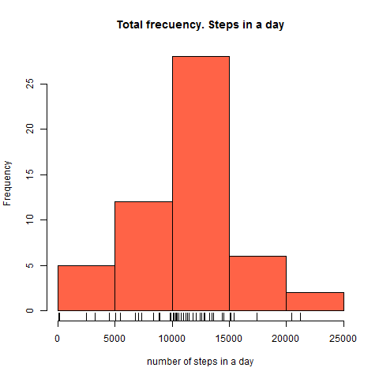
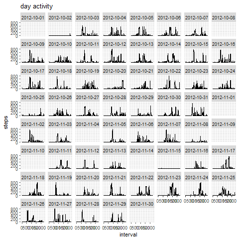
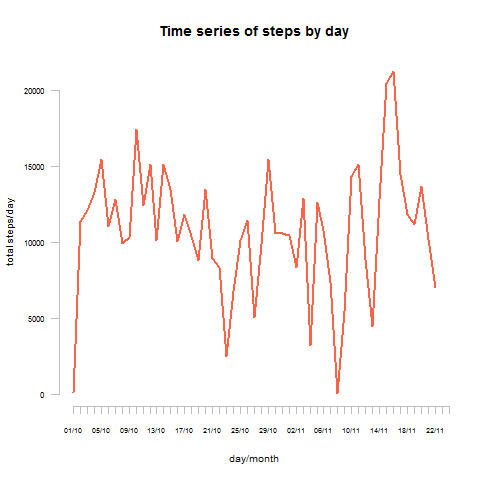
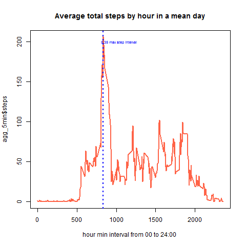
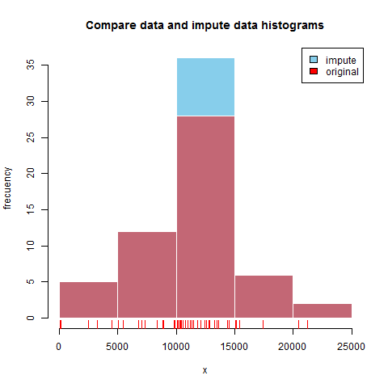
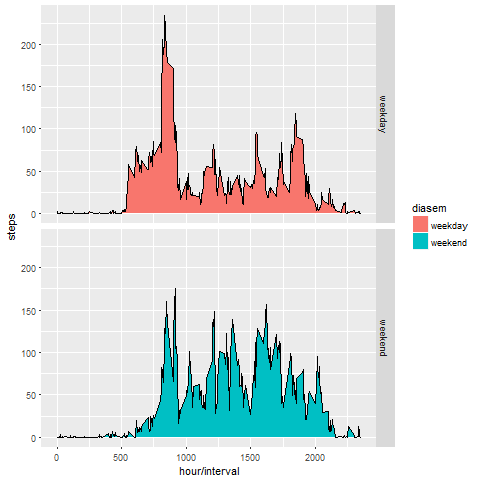

## WEEK 2 Peer-graded Assignment: Course Project 1

In this document we show the answer to the assignment questions. This is a single R markdown file that can once processed by knitr show the results and analisys of the data.

### Code for reading in the dataset and/or processing the data

First we need to read data from website, download to the PC and unzip.
For that we use the following code:

```{r data_download, eval=FALSE}
    library(httr) 

    url <- "https://d396qusza40orc.cloudfront.net/repdata%2Fdata%2Factivity.zip"
    file <- "repdata_data_activity.zip"
    
    #donwload file in PC
    download.file(url, file, method = "wininet")

    # Unzip file
    unzip(file, list = FALSE, overwrite = TRUE)
```


Then we read *.csv file into a data frame called *datos*, and clean NA in a new data frame call *datos_limpios*:

```{r}
    # read csv
    datos <-read.csv("activity.csv")
    datos_limpios<- na.omit(datos) # clean data frame with no NA
    
    # summary
    str(datos)
    #range(datos$interval)
    #unique(datos$date)

```

The variables included in this dataset are:

 * **steps**: Number of steps taking in a 5-minute interval (missing values are coded as NA)
 * **date**: The date on which the measurement was taken in YYYY-MM-DD format
 * **interval**: Identifier o hour for the 5-minute interval in which measurement was taken.
    
### Histogram of the total number of steps taken each day

To show the frecuency of the number of steps in a day, aggregate data by date (days) and sum. We record this in a new variable called *res_day*.

```{r fig.cap="Histograms"}
    # calculate num steps by day 
    res_day<-aggregate(steps~date,datos_limpios,sum)

    #png('imag/plothist.png')
        hist(res_day$steps,col="tomato",
             main= "Total frecuency. Steps in a day",
             xlab="number of steps in a day" )
        rug(res_day$steps) # add cases
    #dev.off()
    #
    library(ggplot2)
    # an other way of seen 
    # total activity day by day 
        qplot(interval,steps,data=datos,
              geom="line",main= "day activity",
              facets = ~ date)
```




### Mean and median number of steps taken each day

With *summary(res_day)* we obtein this numbers and others.

```{r}
    # summary stadistics
    summary(res_day)
```

The mean number of steps taken each day is `r summary(res_day)[4,2]` and the median number of steps is `r summary(res_day)[3,2]`.


### Time series plot of the average number of steps taken

First we plot a daly time series of the sum of steps taken each day during the test days in october and november.

```{r fig.cap="daily time series sum steps" }
    # plot(res_day$steps,type = "h", main= "Total steps by day")
    # transform date for label x axis
    adias<- as.character((levels(res_day$date)))
    adias<-strptime(adias, "%Y-%m-%d")
    
    plot(res_day$steps,type = "l",col="tomato1",
         axes=FALSE,cex.lab = 0.8,lwd=2,
         main= "Time series of steps by day",
         xlab="day/month",ylab="total steps/day"
         )
    axis(1,labels=format(adias, "%d/%m"),
         at=1:length(levels(res_day$date)),
         col="gray",cex.axis = 0.6)
    axis(2,las=1,col="gray",cex.axis = 0.7)
```


As we want to summarize a "normal" day, we take the mean of steps each **interval** for all days, and plot the result:

```{r}
    # calculate aggregate each 5 min interval for all dates 
    agg_5min<-aggregate(steps~interval,datos_limpios,mean)
    
    # calculate max interval for plotting issues
    max(agg_5min$steps)
    maxInterval <- agg_5min[ agg_5min$step == max( agg_5min$step ), 'interval']
    
    # Plot the average day
    plot(agg_5min$interval,agg_5min$steps,type = "l",
         col="tomato1", lwd=2,
         main= "Averatotal steps by hour in a mean day",
         xlab="hour min interval from 00 to 24:00 ")
    # add vertical line in max interval
    abline(v=maxInterval, col="blue",lwd=2, lty=3)
    # add text in max interval
    text(x=maxInterval+200, y=200, label="8:35 max step interval", cex = 0.6, col="blue")
```


### The 5-minute interval that, on average, contains the maximum number of steps

As we did in the previous plot, the maximun interval is at `r eval(maxInterval)` ( 08:35 AM )

### Code to describe and show a strategy for imputing missing data

First we have to see the number of missing data
```{r}
    num_NA <- sum(is.na(datos))
    #Total number o f NA in data frame
    num_NA
    
    # Total number of NA by day- SPLIT data frame
    num_NA_byDay<-split(datos$steps,datos$date)
    # this function sum each row of the last split data frame step/day
    NA_count <-sapply(num_NA_byDay, function(y) sum(length(which(is.na(y)))))
    # save as data frame
    NA_count <- data.frame(NA_count)
    #NA_count <-NA_count[NA_count$NA_count>0,]
    #subset(NA_count,NA_count$NA_count>0)
    
    # to format table in HTML we use Kable
    library(knitr)
    kable(NA_count, caption="NA by day of data",
          row.names = TRUE,
          col.names = c("Num NA"),
          align = c('r', 'l'),
          digits = 1,
          format.args = list( decimal.mark = ","))
     
```

As we see in last table, the problem is that we found completed missing days of data as all missing values sum 288 cases a day or equal 288*5 = 1440 min = 24 h = 1day

With this in mind, an option to impute missing values is to assign the average histogram for those NA days. 

We store the new data frame with this impute values and days in **impute_datos**. 

```{r}
    # function for calculate the value of the 
    # average histogram in a given interval
    getmedia<-function(interval){
        agg_5min[agg_5min$interval==interval,]$steps
    }
    
    # clon dataframe 
    impute_datos<-datos
    # select NA steps --> interval values
    impute_datos<-impute_datos[is.na(impute_datos$steps),c('interval')]
    # pass function to this select data to calculate each impute value
    impute_datos1<-sapply(impute_datos,getmedia)
    #change data NA with average in impute data frame
    impute_datos<-datos
    impute_datos[is.na(impute_datos$steps),c('steps')]<-impute_datos1
```


### Histogram of the total number of steps taken each day after missing values are imputed
As we did before, we calculate the histogram for each data frame, separately, and paint tehn in the same plot.

As we see the only difference (obvious) is the increase in the frequency of the average case (blue for impute data frame)

```{r}
    #calculate impute data frame histogram
    res_dayNoNA<-aggregate(steps~date,impute_datos,sum)
    
    # Plot impute data frame
    hist(res_dayNoNA$steps,col='skyblue',border=F,
        main="Compare data and impute data histograms", xlab="x" , ylab="frecuency")
    rug(res_dayNoNA$steps,col = "blue")
    ## add original data 
    hist(res_day$steps,add=T,col=scales::alpha('red',.5),border=F, xlab="x")
        rug(res_day$steps,col = "red")
    legend("topright", c("impute", "original"), fill=c("skyblue", "red"))
```


### Panel plot comparing the average number of steps taken per 5-minute interval across weekdays and weekends

For that question we add a factor varible to original data frame.

```{r}

    datos$diasem<-c("weekday")
    datos[weekdays(as.Date(datos[, 2])) %in% c("sábado", "domingo"), ]$diasem <- c("weekend")
    # to count how many weekend days
    table(datos$diasem == "weekend")
```

I decided not to chose impute data.

```{r}
    # calculate aggregate by 5 min interval
    agg_5min<-aggregate(steps~interval+diasem,datos,mean)
        qplot(interval,steps,data = agg_5min,
              geom=c("area","line"),xlab="hour/interval",
              facets = diasem ~.,
              fill=diasem)
```



It seem in weekend we start later to walk.

### All of the R code needed to reproduce the results (numbers, plots, etc.) in the report

This -.Rmd file is the compilation of the analysis and the results of the study.
